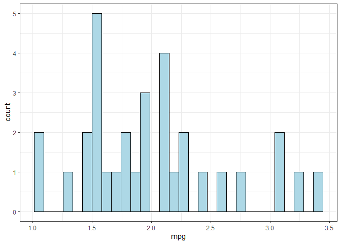
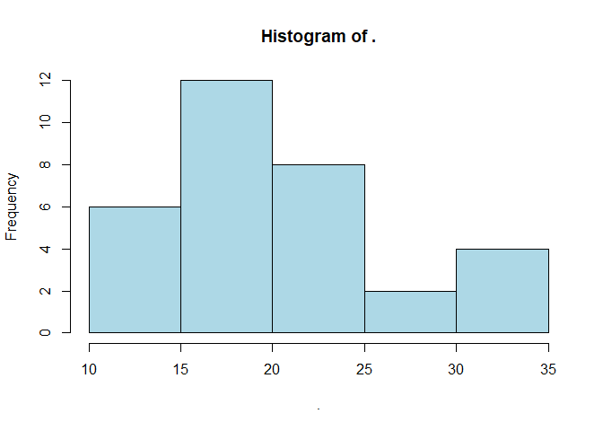
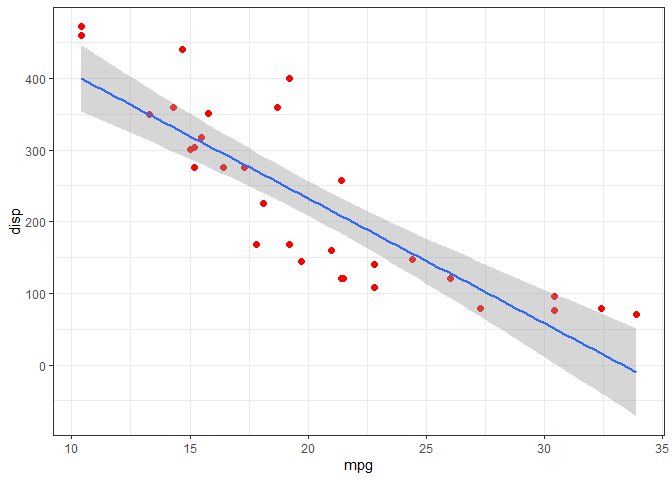

Demo analysis
================

- [This is the first section](#this-is-the-first-section)
- [This should be another section](#this-should-be-another-section)

This is the demo analysis.

The first thing to do is have setup block. This block is for:

- Setting code environment
- Load libraries
- Setting parameters

## This is the first section

You can print pretty tables using `knitr::kable()`

|                   |  mpg |
|:------------------|-----:|
| Mazda RX4         | 21.0 |
| Mazda RX4 Wag     | 21.0 |
| Datsun 710        | 22.8 |
| Hornet 4 Drive    | 21.4 |
| Hornet Sportabout | 18.7 |
| Valiant           | 18.1 |

Most times we want visualizations to tell us more stories or insights
regarding the data collected.

<!-- -->

This plot shows the miles per gallon distribution in the `mtcars`
dataset.

<!-- -->

## This should be another section

Now, we could fit a line of best fit to the plot (when they’re
scatterplots).

<!-- -->
